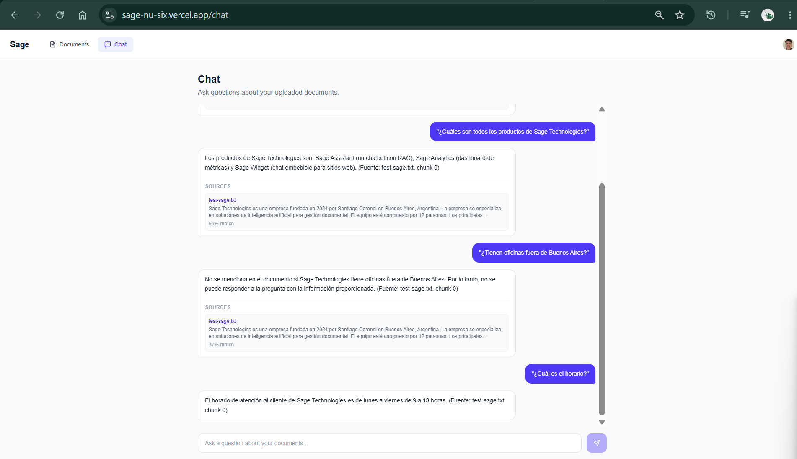
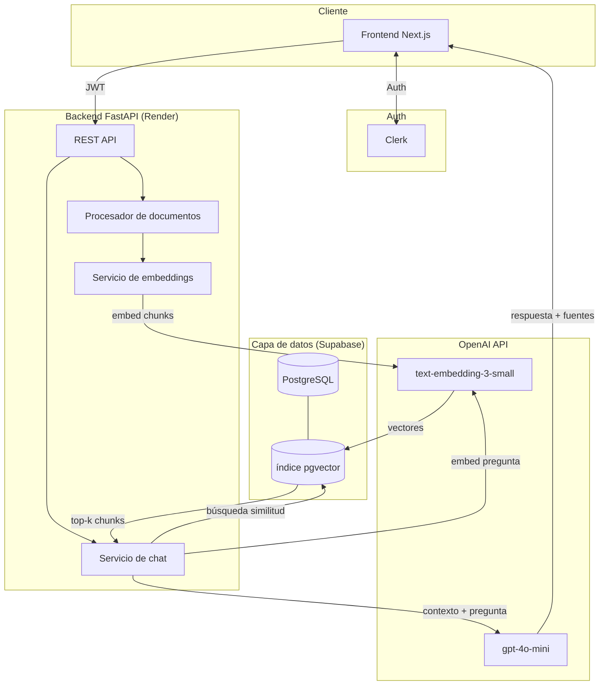

# Sage — Asistente de conocimiento

> Asistente de IA privado que responde preguntas a partir de los documentos de tu empresa. Subís PDFs y TXTs, hacés preguntas, y Sage responde con citas de la fuente exacta.

**Demo en vivo:** [sage-nu-six.vercel.app](https://sage-nu-six.vercel.app) · **Repo:** [github.com/Santi-coronel/Sage](https://github.com/Santi-coronel/Sage)



---

## Qué es esto

La mayoría de las empresas tienen toneladas de documentos internos que nadie puede encontrar cuando los necesita — manuales, contratos, specs técnicas. Los asistentes de IA genéricos no tienen acceso a archivos privados, y las plataformas de búsqueda empresarial cuestan demasiado para equipos chicos.

Sage es un sistema RAG completo: subís tus documentos, y tenés un asistente que responde preguntas de esos documentos, citando exactamente qué archivo y qué parte usó para responder.

---

## Arquitectura



### Flujo — subida de documento
```
POST /api/v1/documents/
    → validar archivo (PDF/TXT, ≤ 20MB)
    → crear registro Document (status: pending)
    → devolver 202 inmediatamente
    → [tarea en background]
        → extraer texto
        → dividir en chunks con overlap (~800 tokens, 100 de overlap)
        → embeddear todos los chunks en una sola llamada a la API
        → INSERT chunks + vectores en document_chunks
        → actualizar Document status: ready
```

### Flujo — consulta de chat
```
POST /api/v1/chat/
    → embeddear la pregunta
    → búsqueda de similitud coseno en document_chunks WHERE tenant_id = $user
    → recuperar los 5 chunks más relevantes
    → enviar [system prompt + chunks + pregunta] a gpt-4o-mini
    → devolver respuesta + citas con puntajes de similitud
```

---

## Stack y decisiones técnicas

### Next.js 16 + TypeScript + Tailwind

Usé App Router principalmente porque los redirects de autenticación corren server-side antes de que se envíe cualquier HTML. Con Vite + React eso se maneja del lado del cliente, lo que da una experiencia peor. TypeScript es obligatorio cuando están tocando auth, uploads y contratos de API al mismo tiempo. Tailwind sin librería de componentes es suficiente para un proyecto individual y evita overhead innecesario.

### Clerk

El JWT de Clerk incluye `org_id` en el payload, que es exactamente lo que necesitaba para aislar datos de cada tenant a nivel SQL sin tablas custom. Construir multi-tenancy desde cero (con NextAuth + sesiones custom + manejo de organizaciones) hubiera costado una semana que prefería invertir en el producto.

### FastAPI

El backend es donde está el trabajo interesante: I/O async para procesar documentos, orquestar llamadas a OpenAI, el pipeline RAG. FastAPI es async nativo y el ecosistema Python para esto (openai SDK, pypdf, asyncpg) está más maduro que el equivalente en Node.

### pgvector en Supabase

En lugar de correr una base de datos vectorial separada (Pinecone, Qdrant), guardo los embeddings como columnas `vector(1536)` en la misma instancia de Postgres. La ventaja principal: similitud vectorial y filtros relacionales en una sola query — `WHERE tenant_id = $user ORDER BY embedding <=> $question_vector`. Un solo connection pool, ningún servicio extra para deployar o monitorear.

Supabase viene con pgvector preinstalado, Postgres administrado y un editor SQL, lo que simplificó bastante el manejo del schema.

A 10M+ chunks, Qdrant ganaría — indexado HNSW, filtrado nativo por payload, mejor throughput. Para escala MVP (cientos de documentos por tenant) pgvector da sub-100ms y la arquitectura se mantiene simple. Qdrant está en el roadmap v2.

### OpenAI API

`text-embedding-3-small` para embeddings: 1536 dimensiones, $0.02 por millón de tokens, mejor que ada-002. `gpt-4o-mini` para generación: rápido, barato, bueno siguiendo instrucciones para respuestas acotadas a contexto.

---

## El pipeline RAG

El enfoque naive — meter todos los documentos en el context window — se rompe rápido:

| Problema | Contexto completo | RAG |
|---|---|---|
| Costo | 200 páginas × tarifas de gpt-4o = $0.50+/query | ~$0.001/query (5 chunks + respuesta corta) |
| Límite de contexto | GPT-4o tiene tope de 128k tokens — un PDF grande puede superarlo | Irrelevante. El índice no tiene límite |
| Precisión | Demasiado ruido cuando el contexto es grande | El modelo solo ve los 5 pasajes más relevantes |
| Escala | Más documentos = prompts más largos para siempre | Más documentos = más filas. El tiempo de query es constante |

Lo que implementé:

1. **Chunking:** Párrafos primero, oraciones como fallback. Chunks de ~800 tokens con 100 de overlap. El overlap importa en texto legal o técnico, donde una oración en el medio de un chunk puede referenciar una definición de la oración anterior.

2. **Embedding en batch:** Todos los chunks de un documento salen en una sola llamada a la API en vez de una por chunk. ~10× más barato y más rápido.

3. **Búsqueda filtrada por tenant:** Cada query de pgvector filtra `WHERE tenant_id = $user` antes del ranking por similitud. El aislamiento está a nivel SQL, no en lógica de aplicación — no podés construir una request que traiga chunks de otro tenant.

4. **Temperature = 0.1:** El modelo tiene instrucciones de responder solo con el contexto provisto y citar fuentes. Temperatura baja reduce alucinaciones en tareas de recuperación factual.

---

## Desafíos técnicos

### Aislamiento multi-tenant

Cada fila de `Document` y `DocumentChunk` lleva un `tenant_id` — el `org_id` de Clerk para cuentas de organización, o el `user_id` para cuentas individuales. El backend lo deriva del JWT verificado en cada request; el cliente nunca lo envía. Conocer el ID de un documento no alcanza — el filtro de tenant se aplica a nivel SQL en cada lectura.

### Procesamiento async de documentos

Procesar un PDF y convertirlo en embeddings puede tardar entre 10 y 30 segundos. El endpoint de upload devuelve `202 Accepted` inmediatamente después de guardar el metadata, y el procesamiento real corre como un `BackgroundTask` de FastAPI. El frontend hace polling cada 5 segundos y actualiza el badge de estado (`pending → processing → ready`). Los errores de procesamiento quedan capturados en el registro del documento sin romper el upload.

### Performance de búsqueda vectorial

El setup actual usa búsqueda exacta de nearest-neighbor de pgvector. Para volúmenes de una PyME (cientos de documentos, no millones de chunks) eso da sub-100ms sin problema. Cuando el conteo de chunks crezca, la línea comentada en `backend/sql/init.sql` habilita búsqueda aproximada:

```sql
CREATE INDEX ON document_chunks
USING ivfflat (embedding vector_cosine_ops)
WITH (lists = 100);
```

`lists ≈ sqrt(cantidad_de_filas)` es el punto de partida recomendado. Pequeña pérdida de precisión, gran mejora de velocidad a escala.

---

## Roadmap v2

**Qdrant en lugar de pgvector** — Índice HNSW + filtrado nativo por payload a 10M+ chunks. La migración está acotada a `embedding_service.py` y `chat_service.py`.

**Respuestas en streaming** — El endpoint de chat actualmente espera la completion completa. OpenAI streaming + FastAPI `StreamingResponse` mejoraría la latencia percibida.

**Widget embebible** — Un tag `<script>` que las empresas pegan en su sitio existente. Endpoint público de embed + aislamiento por iframe + CORS por dominio.

**Analíticas de uso** — Queries por día, temas más consultados, documentos sin resultados. Ya está implícito en los logs de requests, solo falta surfacearlo.

**Índice IVFFlat** — Habilitar cuando el conteo de chunks supere ~50k filas (ver `backend/sql/init.sql`).

---

## Setup local

### Requisitos
- Node.js 18+, Python 3.12+, [uv](https://github.com/astral-sh/uv)
- Cuenta de [Clerk](https://clerk.com) · Proyecto de [Supabase](https://supabase.com) · API key de [OpenAI](https://platform.openai.com)

### Base de datos
Ejecutar `backend/sql/init.sql` en el SQL Editor de Supabase para habilitar pgvector y crear el schema.

### Frontend
```bash
cd frontend
cp .env.local.example .env.local   # completar con Clerk keys + URL de la API
npm install && npm run dev          # http://localhost:3000
```

### Backend
```bash
cd backend
cp .env.example .env               # completar con todas las keys
uv venv .venv --python 3.12
uv pip install -r requirements.txt
.venv/Scripts/uvicorn app.main:app --reload   # http://localhost:8000
```

---

## Deploy

| Capa | Plataforma | Config |
|---|---|---|
| Frontend | Vercel | Root dir: `frontend` — auto-deploy en cada push |
| Backend | Render | Root dir: `backend` — Python 3.12 via `.python-version` |
| Base de datos | Supabase | Session Pooler en puerto 5432 |

---

Desarrollado por **Santiago Coronel** — [LinkedIn](https://www.linkedin.com/in/santiago-coronel-22825a1a8) · [GitHub](https://github.com/Santi-coronel)
